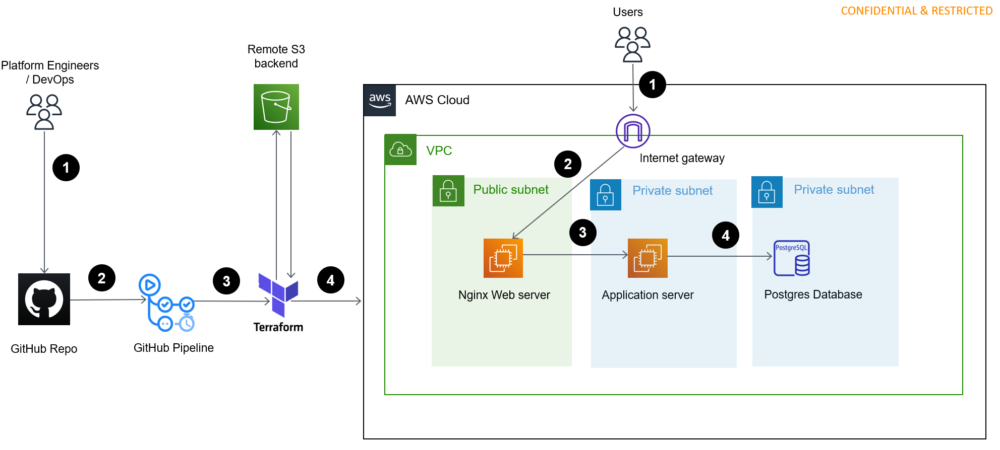

## User request flow
 1. Users sends a request to  nginx server  which comes first at internet gateway at our vpc.
 2. From internet gateway ,request is passed to  nginx server . Nginx server  act as a reverse proxy for the application server.
 3. Nginx server routes the request to java application deployed on application server .
 4. Application server fetch/update the data from postgres database,fulfills user request and return a response back to user.

 ## Infrastructure deployment flow
1. Platform engineers/Devops push commits to modify the infrastructure to github repo.
2. As soon as commit is pushed to main branch, it will automatically start a github actions pipeline.
3. github actions deployement workflow  installs terraform cli and starts a terraform deployment.
4. Terraform deployment includes init , plan and apply stages which successfully deploy new infra into AWS.

## Description of components in Architecture Diagram
1. Vpc - A private VPC which contains all our services
2. Internet gateway- It provides internet access to/from VPC.
3. nginx server- EC2 instance with nginx installed.It is deployed in public subnet and can accessible from internet.
4. application server - EC2 instance with apache tomcat server installed. It is deployed in private subnet and  accessible only through nginx server in public subnet. 
5. Postrges Database- RDS instance with Postgres engine.It is deployed in private subnet and only accessible by application server in private subnet
6. Security groups - Security groups are attached to  all instances to block/allow traffic across different subnets.
7. Github action - Github action is used to automate infrastructure deployement using terraform
8. Terraform - terraform is used to add/delete/modify infrastructure in AWS as per requirements.
9. S3 bucket - S3 bucket is used as remote backend to store terraform state files securely.

## Description of Files
1. main.tf - It contains remote backend and providers configuration.
2. vpc.tf  - It contains configuration for AWS resources such as vpc,subnets,routes and security groups
3. ec2.tf  - It contains config for deploying nginx server , application server and postgres database.
4. variables.tf - It contains variables to be used by different terraform files.
5. .github/workflows/deploy.yaml - It contains configuration for our github actions pipeline.